# Agentic DJ — Dissertation Thesis

An agentic DJ system that adapts music selection in real time based on listener state. Built as part of a university dissertation.

> **Note:** Always activate the virtual environment before working on the project:
> ```bash
> source .venv/bin/activate
> ```

---

## Progress Map



---

## Setup

```bash
python -m venv .venv
source .venv/bin/activate
pip install -e .
```

Copy `.env.example` to `.env` and fill in your API keys:

```
SPOTIPY_CLIENT_ID=
SPOTIPY_REDIRECT_URI=
LASTFM_API_KEY=
```

## Run the Streamlit app (requires .env populated)
```
streamlit run app/app.py
```